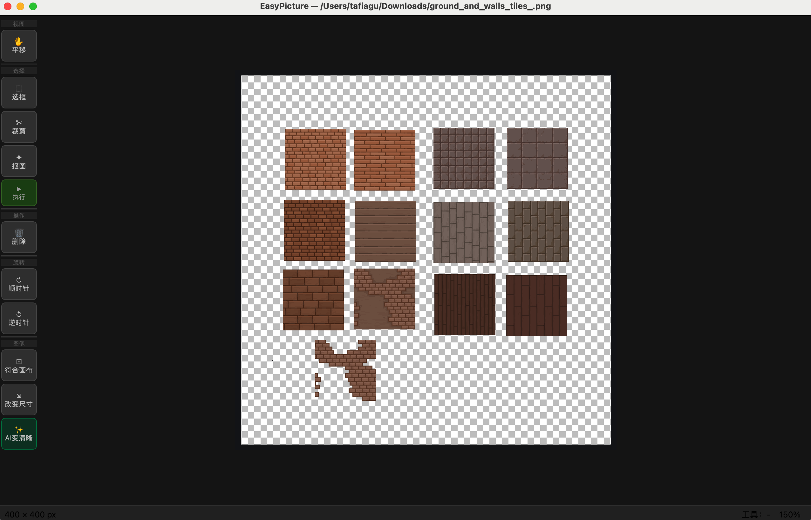
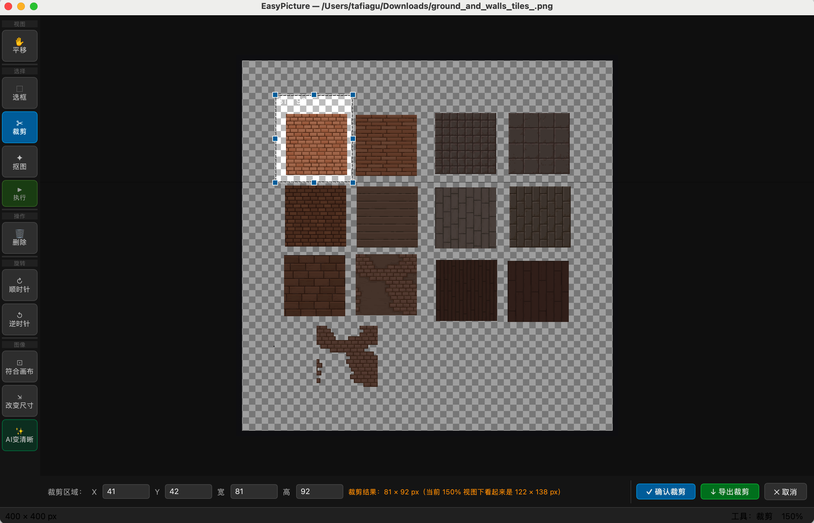
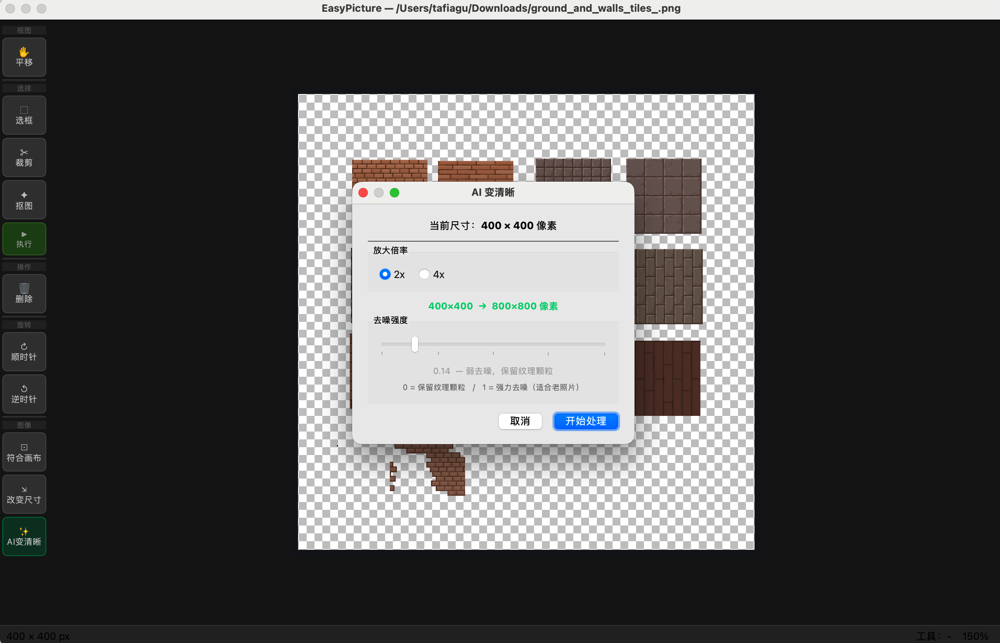

# EasyPicture

轻量级本地桌面图片编辑工具，全程本地处理，图片质量完整保留，无需联网。

## 功能特性

| 功能 | 说明 |
|------|------|
| **导入 / 导出** | 支持 PNG、JPG、BMP、TIFF、WEBP；PNG 无损保留 Alpha，JPG 可调质量 |
| **裁剪** | 鼠标拖拽框选，支持底部面板数值精确输入，可单独导出局部区域 |
| **区域删除** | 框选后一键删除，PNG 填充透明，JPG 填充白色 |
| **抠图（背景去除）** | 基于 OpenCV GrabCut + 形态学修复 + 连通域分析 + 边缘羽化，生成透明背景图 |
| **旋转** | 顺时针 / 逆时针 90° 无损旋转 |
| **符合画布** | 一键裁去四周透明像素，保留主体内容最小边界框（抠图后常用） |
| **缩放到指定尺寸** | 自定义宽高或百分比，可锁定宽高比，LANCZOS4 高质量插值 |
| **AI 变清晰** | 基于 Real-ESRGAN 神经网络，真正重建图片细节；支持 **2x / 4x** 放大，可调去噪强度，放大后图像作为新工作图像 |
| **平移工具** | 手型工具拖拽画面，或按住空格键临时切换 |
| **撤销 / 重做** | 最多 20 步 Undo/Redo |



## 环境要求

- Python **3.11+**（推荐 3.12 arm64，已在 Apple Silicon Mac 验证）
- [uv](https://github.com/astral-sh/uv) 包管理器

## 快速开始

```bash
# 1. 克隆项目
git clone https://github.com/yourname/easyPicture.git
cd easyPicture

# 2. 安装依赖（uv 自动创建虚拟环境）
uv sync

# 3. 启动应用
uv run python main.py
```

> **Apple Silicon Mac**：推荐使用原生 arm64 Python 以获得最佳性能：
> ```bash
> uv venv --python cpython-3.12-macos-aarch64
> uv sync
> uv run python main.py
> ```

## AI 变清晰模型配置

AI 变清晰功能需要额外配置模型文件（`.pth` → `.onnx` 转换，仅需一次）：

### 步骤 1：下载模型

从以下地址下载 `RealESRGAN_x4plus_anime_6B.pth`：

- [GitHub Releases](https://github.com/xinntao/Real-ESRGAN/releases)
- [HuggingFace](https://huggingface.co/gemasai/RealESRGAN_x4plus_anime_6B/tree/main)

下载后放入项目根目录的 `models/` 文件夹。

### 步骤 2：转换为 ONNX 格式

```bash
uv run --with torch --with onnx python tools/convert_to_onnx.py RealESRGAN_x4plus_anime_6B.pth
```

转换完成后生成 `models/RealESRGAN_x4plus_anime_6B.onnx`，即可使用 AI 功能。

> 详见 [models/README.md](models/README.md)，支持切换多种模型。

## 使用说明

### 打开图片

- 菜单栏 **文件 → 打开**，或快捷键 `Cmd/Ctrl+O`
- 直接将图片文件**拖拽**到窗口

### 裁剪

1. 点击左侧工具栏「✂ 裁剪」按钮
2. 在画布上拖拽框选区域（或在底部面板输入精确数值）
3. 点击「确认裁剪」或「导出裁剪区域」（导出不修改原图）



### 抠图（去除背景）

1. 点击工具栏「✦ 抠图」按钮（激活框选模式）
2. 在图片上拖拽框选**主体**区域
3. 点击工具栏「▶ 执行」按钮开始计算
4. 等待进度条完成，背景变为透明
5. 可继续点击「⊡ 符合画布」去除边缘空白

### AI 变清晰

1. 点击工具栏「✨ AI变清晰」按钮
2. 选择放大倍率（**2x** 或 **4x**）
3. 调整去噪强度（0 = 保留纹理颗粒 / 1 = 强力去噪）
4. 点击「开始处理」，等待进度条完成
5. 图片尺寸变为原来的 2x 或 4x，细节得到重建
6. 可继续使用裁剪等工具对放大后的图片操作



### 导出图片

- 菜单栏 **文件 → 导出**，或快捷键 `Cmd/Ctrl+S`
- 含透明区域的图片建议导出为 **PNG**

### 常用快捷键

| 操作 | macOS | Windows |
|------|-------|---------|
| 打开 | `Cmd+O` | `Ctrl+O` |
| 导出 | `Cmd+S` | `Ctrl+S` |
| 退出 | `Cmd+Q` | `Ctrl+Q` |
| 撤销 | `Cmd+Z` | `Ctrl+Z` |
| 重做 | `Cmd+Y` / `Cmd+Shift+Z` | `Ctrl+Y` / `Ctrl+Shift+Z` |
| 顺时针旋转 90° | `Cmd+]` | `Ctrl+]` |
| 逆时针旋转 90° | `Cmd+[` | `Ctrl+[` |
| 缩放图片 | `Cmd+Alt+R` | `Ctrl+Alt+R` |
| 视图放大 | `Cmd+=` | `Ctrl+=` |
| 视图缩小 | `Cmd+-` | `Ctrl+-` |
| 适合窗口 | `Cmd+0` | `Ctrl+0` |
| 取消选区 | `Esc` | `Esc` |
| 删除选区内容 | `Delete` / `Backspace` | `Delete` / `Backspace` |
| 临时平移 | 按住 `Space` 拖拽 | 按住 `Space` 拖拽 |

## 打包为可执行文件

### macOS（生成 .app）

```bash
# 一键打包
bash scripts/build_mac.sh

# 输出：dist/EasyPicture.app
open dist/EasyPicture.app
```

### Windows（生成 .exe）

在 Windows 机器上，双击运行：

```bat
scripts\build_win.bat
```

输出：`dist\EasyPicture\EasyPicture.exe`（将整个 `EasyPicture\` 目录打包 zip 分发即可）

### GitHub Actions 自动打包

推送版本标签可自动触发 macOS + Windows 双平台打包并创建 Release：

```bash
git tag v0.1.0
git push --tags
```

详见 [.github/workflows/build.yml](.github/workflows/build.yml)。

## 项目结构

```
easyPicture/
├── main.py                    # 入口
├── pyproject.toml             # 项目依赖（uv 管理）
├── easypicture.spec           # macOS PyInstaller 打包配置
├── easypicture_win.spec       # Windows PyInstaller 打包配置
├── models/                    # AI 模型文件（不提交 git）
│   ├── README.md              # 模型下载与转换说明
│   ├── RealESRGAN_x4plus_anime_6B.pth   # 原始权重（下载后放入）
│   └── RealESRGAN_x4plus_anime_6B.onnx  # 推理用 ONNX（由 .pth 转换生成）
├── core/
│   ├── image_model.py         # 图像数据模型（唯一数据源）
│   ├── image_processor.py     # 纯函数图像处理（裁剪、旋转、缩放…）
│   ├── grabcut.py             # GrabCut 抠图（QThread 异步）
│   ├── realesrgan.py          # Real-ESRGAN 推理（分块 + QThread 异步）
│   └── history.py             # 撤销 / 重做历史栈
├── ui/
│   ├── main_window.py         # 主窗口布局与菜单
│   ├── canvas.py              # 画布（显示、缩放、选区交互）
│   ├── toolbar.py             # 左侧工具栏
│   ├── crop_panel.py          # 裁剪面板（数值输入）
│   └── dialogs.py             # 对话框（JPEG 质量、缩放、AI 参数）
├── controller/
│   └── app_controller.py      # 信号 / 槽中枢，连接 UI 与 Core
├── tools/
│   └── convert_to_onnx.py     # .pth → .onnx 模型转换脚本
├── scripts/
│   ├── build_mac.sh           # macOS 一键打包脚本
│   └── build_win.bat          # Windows 一键打包脚本
├── imgs/                      # README 文档截图
├── resources/                 # 图标等静态资源
├── .github/
│   └── workflows/
│       └── build.yml          # GitHub Actions 自动双平台打包
└── docs/                      # 设计文档
    ├── PRD.md
    ├── TECH_DESIGN.md
    ├── MODULE_API.md
    └── AI_IMPL_GUIDE.md
```

## 技术栈

| 组件 | 版本 | 用途 |
|------|------|------|
| Python | ≥ 3.11 | 运行环境 |
| PyQt6 | ≥ 6.5 | UI 框架 |
| OpenCV contrib | ≥ 4.8 | 图像处理、GrabCut |
| NumPy | ≥ 1.24 | 图像数组操作 |
| Pillow | ≥ 10.0 | 辅助格式支持 |
| onnxruntime | ≥ 1.17 | Real-ESRGAN AI 推理（无需 PyTorch） |
| uv | 最新 | 包管理与虚拟环境 |
| PyInstaller | ≥ 6.0 | 打包为可执行文件（可选） |

## 第三方依赖与致谢

### AI 模型

**Real-ESRGAN**（`RealESRGAN_x4plus_anime_6B`）

- **来源**：[xinntao/Real-ESRGAN](https://github.com/xinntao/Real-ESRGAN)
- **作者**：Xintao Wang 等
- **论文**：[Real-ESRGAN: Training Real-World Blind Super-Resolution with Pure Synthetic Data](https://arxiv.org/abs/2107.10833)（ICCV 2021 Workshop）
- **模型下载**：[GitHub Releases](https://github.com/xinntao/Real-ESRGAN/releases) / [HuggingFace](https://huggingface.co/gemasai/RealESRGAN_x4plus_anime_6B)
- **License**：[BSD 3-Clause](https://github.com/xinntao/Real-ESRGAN/blob/master/LICENSE)

> EasyPicture 仅使用模型权重进行本地推理，不对模型本身做任何修改。

### 运行时库

| 库 | 主页 | License |
|----|------|---------|
| [PyQt6](https://www.riverbankcomputing.com/software/pyqt/) | Riverbank Computing | GPL v3 / 商业双授权 |
| [OpenCV](https://opencv.org/) | opencv.org | Apache 2.0 |
| [NumPy](https://numpy.org/) | numpy.org | BSD |
| [Pillow](https://python-pillow.org/) | python-pillow.org | HPND（类 MIT） |
| [ONNX Runtime](https://onnxruntime.ai/) | Microsoft | MIT |

### 工具链

| 工具 | 主页 | 用途 |
|------|------|------|
| [uv](https://github.com/astral-sh/uv) | Astral | Python 包管理 |
| [PyInstaller](https://pyinstaller.org/) | pyinstaller.org | 打包为可执行文件 |

## 注意事项

- **抠图质量**：受主体与背景对比度影响，建议在对比度明显的图片上使用
- **AI 变清晰性能**：CPU 推理，512×512 约需 10-60 秒；图片越大耗时越长
- **格式透明**：导出 JPG 时透明区域自动合并到白色背景；建议抠图后导出 PNG
- **视图缩放 vs 改变尺寸**：`Cmd/Ctrl ±` 只改变显示比例不修改图片；「改变尺寸」才真正修改像素

## License

MIT
